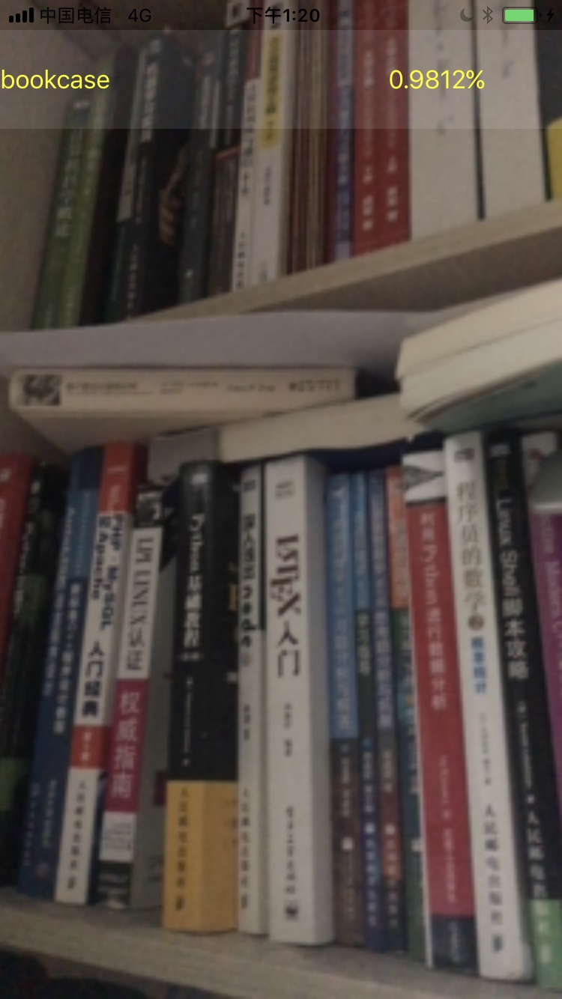

# Core ML Real-time Classifier Demo

A real-time classifier demo using Core ML and Resnet50 model on iOS 11.

## Installation

Clone the project and download the [Resnet50 model](https://docs-assets.developer.apple.com/coreml/models/Resnet50.mlmodel), drag it into  the project and Xcode will handle the rest (such as generating .swift file)! 

You can use other model as well, but you need to convert other model to .mlmodel file using [Core ML Tools](https://pypi.python.org/pypi/coremltools).

## TODO

- [ ] Add a simple tutorial about how to train you own classifier using [Keras](https://keras.io/) and [CIFAR-10](https://www.cs.toronto.edu/~kriz/cifar.html) dataset;

~~- [ ] Add YOLO9000 Model for real-time object detection;~~ check [YOLO-CoreML-MPSNNGraph](https://github.com/hollance/YOLO-CoreML-MPSNNGraph)

- [ ] Add SDD model for real-time object detection.

## Warning 

Since real-time forward propagation of nerual network require many hardware resources, you may encounter a number of thermal and performance issues, and don't turn on low-battery mode while runing this app in order to gain better performance.

## License

The MIT License (MIT)

Copyright (c) 2017 Chevalier Meirtz

Permission is hereby granted, free of charge, to any person obtaining a copy of this software and associated documentation files (the "Software"), to deal in the Software without restriction, including without limitation the rights to use, copy, modify, merge, publish, distribute, sublicense, and/or sell copies of the Software, and to permit persons to whom the Software is furnished to do so, subject to the following conditions:

The above copyright notice and this permission notice shall be included in all copies or substantial portions of the Software.

THE SOFTWARE IS PROVIDED "AS IS", WITHOUT WARRANTY OF ANY KIND, EXPRESS OR IMPLIED, INCLUDING BUT NOT LIMITED TO THE WARRANTIES OF MERCHANTABILITY, FITNESS FOR A PARTICULAR PURPOSE AND NONINFRINGEMENT. IN NO EVENT SHALL THE AUTHORS OR COPYRIGHT HOLDERS BE LIABLE FOR ANY CLAIM, DAMAGES OR OTHER LIABILITY, WHETHER IN AN ACTION OF CONTRACT, TORT OR OTHERWISE, ARISING FROM, OUT OF OR IN CONNECTION WITH THE SOFTWARE OR THE USE OR OTHER DEALINGS IN THE SOFTWARE.

## Acknowledgments
This project uses [FrameExtractor](https://github.com/b-r-o/FrameExtractor) for iOS camera frame extraction.
